# credit_risk_analysis

An analysis to build and evaluate a dataset from LendingClub to discover credit risk using Supervised Machine Learning Algorithms. 

---

## Overview of the analysis: 

The purpose of this project is analyzing a dataset from LendingClub to evaluate several Machine Learning models to predict credit risk. Using Supervised Machine Learning because the data includes a labeled outcome. The dataset is unbalanced as the number of good loans offsets the number of risky loans. To balance out the classification problem to improve accuracy score and predictions several Machine Learning algorithms were employed to resample the data, they include RandomOverSampler, SMOTE, ClusterCentroids, SMOTEENN, BalancedRandomForestClassifier, and EasyEnsembleClassifier. 

---
## Resources:

Data source: [LoanStats_2019Q1.csv](Module-17-Challenge-Resources/LoanStats_2019Q1.csv)

Tools: Python, Scikit Learn, Imbalanced Learn, Juypter Notebook, Pandas, Mechine Learning, Visual Studio Code

---

## Results: 

To determine whether the application was considered low or high risk, the “loan status” was used and applications that had “current” as the “loan status” were categorized as “low risk” and the remaining were as “high risk”. The dataset was reduced to 68,470 applications total with 99% categorized as “low risk”, from the original dataset that contained over 115,000 loan applications. 

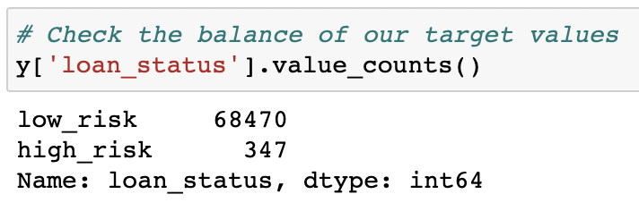

The method to split the data for training vs. testing was 75/25%, low risk: 51,366 and high risk 246. 

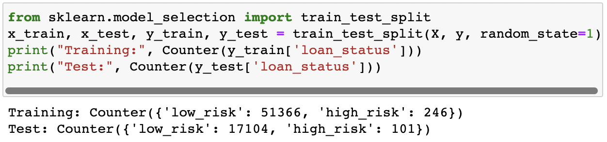

Oversampling:

* RandomOverSampler Model

	* Balanced accuracy score is 66%
	* Low risk precision rate of 100%
	* Low risk recall at 62%
	* High risk precision rate of 1%
	* High risk recall at 71%
	* High risk F1 of 2%

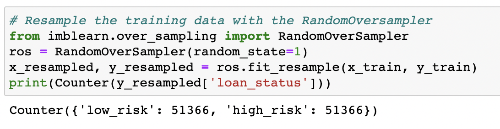
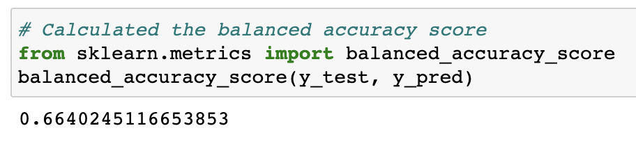
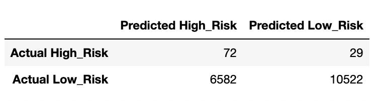
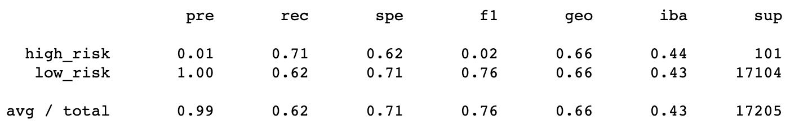

* Synthetic Minority Oversampling Technique (SMOTE) Model

	* Balanced accuracy score is 65%
	* Low risk precision rate of 100%
	* Low risk recall at 68%
	* High risk precision rate of 1%
	* High risk recall at 63%
	* High risk F1 of 2%

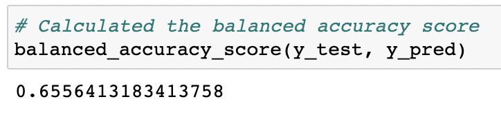
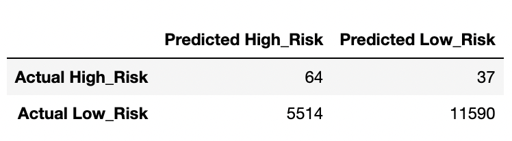
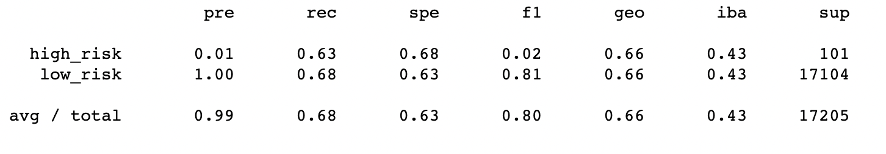

Undersampling:

* ClusterCentroids Model

	* Balanced accuracy score is 54%
	* Low risk precision rate of 100%
	* Low risk recall at 40%
	* High risk precision rate of 1%
	* High risk recall at 69%
	* High risk F1 of 1%

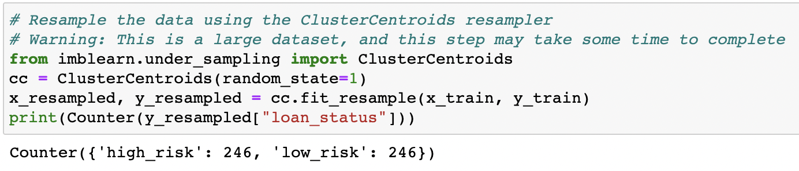
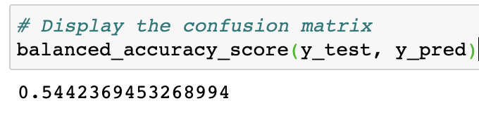
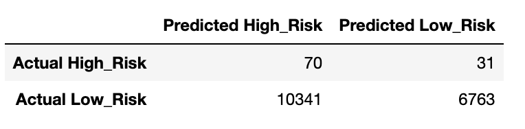
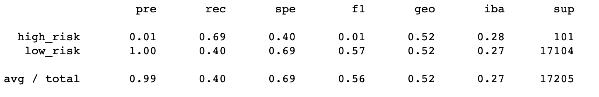

Combination Sampling

* Synthetic Minority Oversampling Technique plus Edited NearestNeighbors (SMOTEENN) Model

	* Balanced accuracy score is 63%
	* Low risk precision rate of 100%
	* Low risk recall at 60%
	* High risk precision rate of 1%
	* High risk recall at 66%
	* High risk F1 of 2%

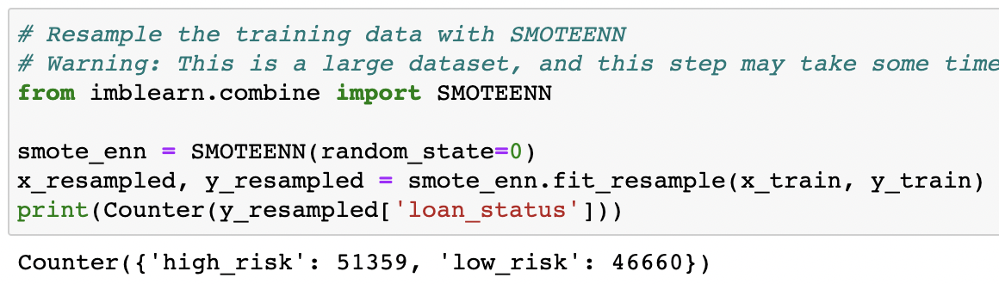
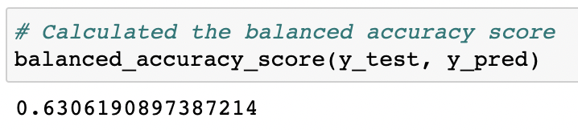
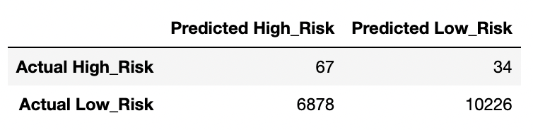
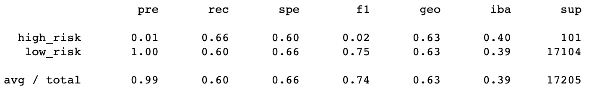

Ensemble Classifiers:

* BalancedRandomForestClassifier Model

	* Balanced accuracy score is 78.7%
	* Low risk precision rate of 100%
	* Low risk recall at 91%
	* High risk precision rate of 4%
	* High risk recall at 67%
	* High risk F1 of 7%
	* Top feature by importance was “total_rec_prncp” at 7.4% of the total

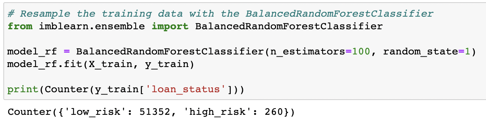
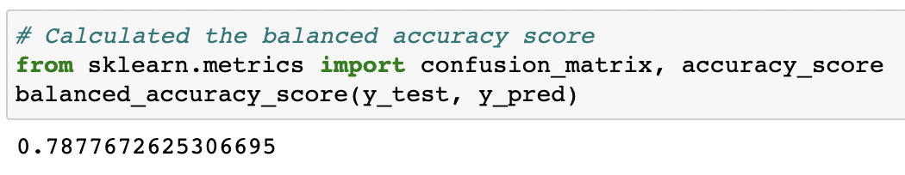
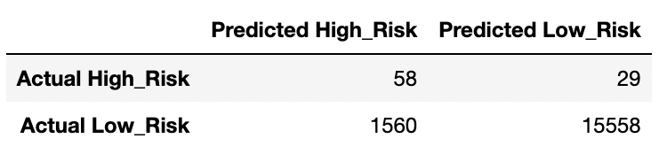
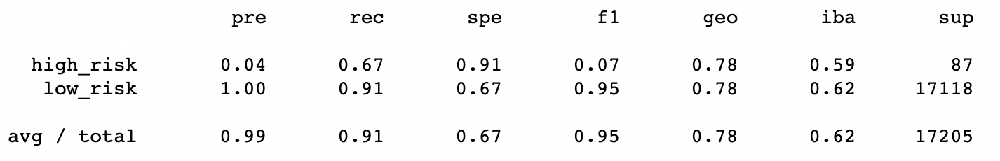
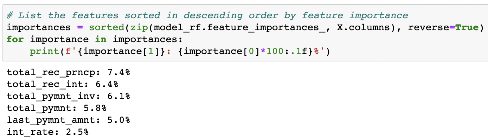

* EasyEnsembleClassifier Model 

	* Balanced accuracy score is 92.5%
	* Low risk precision rate of 100%
	* Low risk recall at 94%
	* High risk precision rate of 7%
	* High risk recall at 91%
	* High risk F1 of 14%

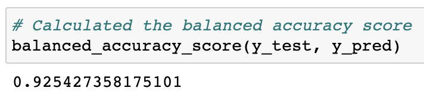
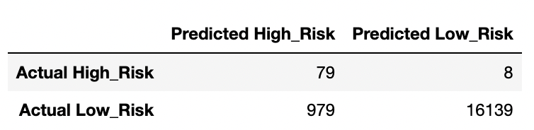
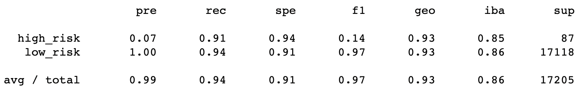

---

## Summary: 
 
The EasyEnsembleClassifier Model yielded the best results with a balanced accuracy score of 92.5% and a high-risk precision rate of 7%. The high-risk recall (sensitivity rate) was also the highest of all the models at 91%, the F1 score of 14%, and the low risk was the highest as well with a sensitivity rate of 94%. Rating all six of the models of machine learning used in this analysis based on high risk in descending order:

* EasyEnsembleClassifier Model: accuracy 92.5%, precision 7%, recall 91%, F1 14%.

* BalancedRandomForestClassifier Model: accuracy 78.7%, precision 4%, recall 67%, F1 7%.

* RandomOverSampler Model: accuracy 66%, precision 1%, recall 71%, F1 2%. 

* SMOTE Model: accuracy 65%, precision 1%, recall 63%, F1 2%.

* SMOTEENN Model: accuracy 63%, precision 1%, recall 66%, F1 2%. 

* ClusterCentroids Model: accuracy 54%, precision 1%, recall 69%, F1 1%. 

---
